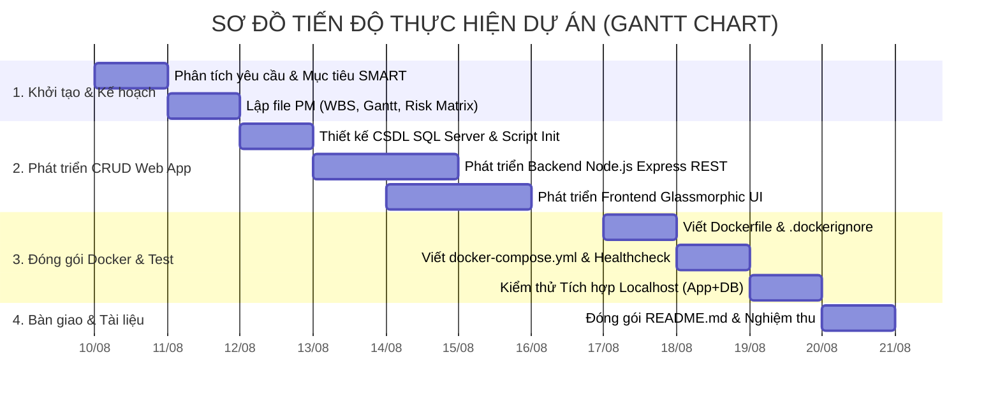

# NHIỆM VỤ 1: BÁO CÁO QUẢN LÝ DỰ ÁN (PROJECT MANAGEMENT DOCUMENTATION)

**Tên dự án**: Xây dựng & Đóng gói Container Ứng dụng Web CRUD Quản lý Nhân sự (Node.js + SQL Server)  
**Mã dự án**: CS-CRUD-2026  
**Ngày lập**: 09/08/2026  
**Đơn vị thực hiện**: Nhóm Đóng gói & Triển khai Điện toán Đám mây  

---

## 1. MỤC TIÊU DỰ ÁN (PROJECT OBJECTIVES)

### 1.1 Khái quát Dự án
Dự án nhằm mục đích thiết kế, xây dựng và đóng gói container một ứng dụng Web CRUD (Create - Read - Update - Delete) đơn giản quản lý dữ liệu nhân sự, triển khai thử nghiệm trên môi trường máy local (localhost) thông qua công nghệ **Docker** và **Docker Compose** với hệ quản trị cơ sở dữ liệu **Microsoft SQL Server**.

### 1.2 Mục tiêu theo Mô hình SMART

| Tiêu chí SMART | Chi tiết Mục tiêu |
| :--- | :--- |
| **S - Specific (Cụ thể)** | Xây dựng thành công ứng dụng Web CRUD bằng Node.js (Express) kết nối SQL Server; đóng gói hoàn chỉnh bằng `Dockerfile` và `docker-compose.yml` để khởi chạy đồng thời App + DB chỉ với một lệnh duy nhất (`docker-compose up`). |
| **M - Measurable (Đo lường được)** | - 100% các API CRUD (GET, POST, PUT, DELETE) hoạt động chính xác.<br>- Thời gian phản hồi API < 200ms.<br>- Giao diện Dashboard chuẩn Glassmorphism, hiển thị đầy đủ thống kê dữ liệu thực.<br>- Khởi động thành công 2 Docker container (`nodejs_crud_app` và `sqlserver_db`) không phát sinh lỗi. |
| **A - Achievable (Khả thi)** | Kiến trúc ứng dụng gọn nhẹ, sử dụng base image `node:18-alpine` tối ưu dung lượng và SQL Server 2022 Developer edition chuẩn hóa. |
| **R - Relevant (Thực tế)** | Phù hợp với yêu cầu thực hành môn Điện toán đám mây & Đóng gói ứng dụng doanh nghiệp (Nhiệm vụ 4 - Phần Docker). |
| **T - Time-bound (Thời hạn)** | Hoàn thiện toàn bộ sản phẩm mã nguồn, đóng gói Docker và bộ tài liệu Nhiệm vụ 1 trong vòng **02 tuần** (10 ngày làm việc). |

### 1.3 Phạm vi Dự án (Project Scope)

> [!NOTE]
> **In-Scope (Nằm trong phạm vi)**:
> - Thiết kế CSDL SQL Server (Table `Employees`, script khởi tạo `init.sql`).
> - Lập trình Backend Node.js RESTful API & Frontend Web Dashboard (HTML5/CSS3/JS).
> - Viết `Dockerfile` và `docker-compose.yml` có cấu hình volume persistence & healthcheck.
> - Lập Bảng phân rã WBS, Sơ đồ Gantt Chart, Mục tiêu dự án & Bảng Đánh giá rủi ro.

> [!WARNING]
> **Out-of-Scope (Nằm ngoài phạm vi)**:
> - Phân quyền người dùng phức tạp (OAuth2 / JWT Authentication / Multi-tenant).
> - Triển khai sản phẩm lên các đám mây công cộng (AWS, Azure, GCP) sản xuất.

---

## 2. BẢNG PHÂN RÃ CÔNG VIỆC (WORK BREAKDOWN STRUCTURE - WBS)

Cấu trúc phân rã công việc được chia thành **4 Giai đoạn chính (Level 1)**, chi tiết đến các gói công việc cụ thể (Level 3 & 4):

```text
1.0 KHỞI TẠO & PHÂN TÍCH YÊU CẦU
├── 1.1 Xác định Yêu cầu & Mục tiêu Dự án
│   ├── 1.1.1 Khảo sát yêu cầu bài toán CRUD
│   └── 1.1.2 Xây dựng bảng mục tiêu SMART
├── 1.2 Lập Kế hoạch Quản lý Dự án
│   ├── 1.2.1 Xây dựng Cấu trúc WBS 4 tầng
│   ├── 1.2.2 Lập Sơ đồ tiến độ Gantt Chart
│   └── 1.2.3 Xây dựng Ma trận Đánh giá Rủi ro (Risk Matrix)

2.0 THIẾT KẾ & PHÁT TRIỂN HỆ THỐNG WEB CRUD
├── 2.1 Thiết kế CSDL & Script SQL Server
│   ├── 2.1.1 Thiết kế ERD & Bảng Employees
│   └── 2.1.2 Viết script init.sql & Seed Data
├── 2.2 Phát triển Backend Node.js Express API
│   ├── 2.2.1 Cấu hình module db.js kết nối SQL Server & Auto-retry
│   ├── 2.2.2 Viết employeeController.js (CRUD APIs + Stats)
│   └── 2.2.3 Khai báo Router & App Server (app.js)
├── 2.3 Phát triển Frontend Web Dashboard
│   ├── 2.3.1 Dựng layout HTML5 & Dashboard Stats (index.html)
│   ├── 2.3.2 Thiết kế CSS Glassmorphic Sleek Dark UI (style.css)
│   └── 2.3.3 Viết JavaScript Fetch API & Event Handling (app.js)

3.0 ĐÓNG GÓI DOCKER & KIỂM THỬ (NHIỆM VỤ 4 DOCKER PORTION)
├── 3.1 Đóng gói Docker Image
│   ├── 3.1.1 Xây dựng Dockerfile cho Node.js App
│   └── 3.1.2 Cấu hình .dockerignore
├── 3.2 Orchestration với Docker Compose
│   ├── 3.2.1 Cấu hình Service SQL Server (port, password, volume)
│   ├── 3.2.2 Cấu hình Service Node.js App & Depends_on Healthcheck
│   └── 3.2.3 Khởi chạy & Kiểm thử `docker-compose up --build`
├── 3.3 Kiểm thử Tích hợp Local Machine
│   ├── 3.3.1 Kiểm thử các API Endpoints (Postman / Browser)
│   └── 3.3.2 Kiểm thử quy trình CRUD dữ liệu trên Giao diện Web

4.0 TỔNG KẾT, BÀN GIAO & LẬP TÀI LIỆU
├── 4.1 Đóng gói Mã nguồn & Viết README.md hướng dẫn
└── 4.2 Tổng kết Tài liệu Nhiệm vụ 1 & Nghiệm thu Sản phẩm
```

### Bảng Chi tiết Công việc WBS

| Mã WBS | Tên Công Việc | Sản Phẩm Đầu Ra | Người Phụ Trách | Thời Lượng |
| :--- | :--- | :--- | :--- | :--- |
| **1.1** | Phân tích Yêu cầu & Mục tiêu | Tài liệu Yêu cầu | PM / BA | 1 ngày |
| **1.2** | Lập Kế hoạch PM (WBS, Gantt, Risk) | Báo cáo Nhiệm vụ 1 | PM | 1 ngày |
| **2.1** | Thiết kế CSDL & SQL Init Script | `sql/init.sql` | DB Admin | 1 ngày |
| **2.2** | Lập trình Backend Node.js Express API | `src/controllers`, `src/routes` | Backend Dev | 2 ngày |
| **2.3** | Thiết kế Giao diện UI/UX & Frontend Script | `src/public/` | Frontend Dev | 2 ngày |
| **3.1** | Viết Dockerfile & Cấu hình Image | `Dockerfile`, `.dockerignore` | DevOps Engineer | 1 ngày |
| **3.2** | Viết `docker-compose.yml` & Orchestration | `docker-compose.yml` | DevOps Engineer | 1 ngày |
| **3.3** | Kiểm thử Tích hợp Docker & Local Machine | Báo cáo test thành công | Tester / DevOps | 1 ngày |
| **4.1** | Viết README & Tổng kết Dự án | `README.md`, `walkthrough.md` | Tech Lead | 1 ngày |

---

## 3. SƠ ĐỒ TIẾN ĐỘ (GANTT CHART)

### 3.1 Sơ đồ Trực quan Gantt Chart (Mermaid Diagram)



### 3.2 Bảng Timeline & Mốc Phụ Thuộc (Dependencies Timeline)

| ID Công việc | Tên Đầu Việc | Ngày Bắt Đầu | Ngày Hoàn Thành | Phụ Thuộc (Predecessors) | Mốc Quan Trọng (Milestone) |
| :---: | :--- | :---: | :---: | :---: | :--- |
| M1 | Duyệt Kế hoạch Dự án & Nhiệm vụ 1 | 2026-08-11 | 2026-08-11 | a1, a2 | 🏁 Milestone 1: Approved Plan |
| M2 | Hoàn thiện Mã nguồn Web CRUD App | 2026-08-16 | 2026-08-16 | b1, b2, b3 | 🏁 Milestone 2: App Source Code Ready |
| M3 | Đóng gói & Chạy thử thành công Docker | 2026-08-19 | 2026-08-19 | c1, c2, c3 | 🏁 Milestone 3: Dockerized Localhost |
| M4 | Bàn giao & Nghiệm thu Toàn bộ Dự án | 2026-08-20 | 2026-08-20 | d1 | 🏁 Milestone 4: Project Complete |

---

## 4. BẢNG ĐÁNH GIÁ RỦI RO (RISK ASSESSMENT & MITIGATION MATRIX)

### 4.1 Thang Đánh giá Rủi ro (Risk Rating Scale)
Mức độ Rủi ro = **Xác suất xảy ra (Likelihood: 1-5)** x **Mức độ ảnh hưởng (Impact: 1-5)**
- **1 - 5 (Thấp - Khả thi)**: Theo dõi định kỳ.
- **6 - 12 (Trung bình)**: Cần có phương án phòng ngừa.
- **15 - 25 (Cao / Nghiêm trọng)**: Cần hành động khắc phục khẩn cấp.

### 4.2 Bảng Ma trận Đánh giá Rủi ro Chi tiết

| ID Rủi Ro | Phân Loại Rủi Ro | Mô Tả Rủi Ro | Xác Suất (L) | Ảnh Hưởng (I) | Điểm Rủi Ro (RxI) | Mức Độ | Biện Pháp Giảm Thiểu (Mitigation Strategy) | Kế Hoạch Dự Phòng (Contingency Plan) |
| :---: | :--- | :--- | :---: | :---: | :---: | :---: | :--- | :--- |
| **R-01** | Technical | SQL Server Docker container khởi động chậm hơn Node.js App làm crash kết nối ban đầu. | 4 | 4 | **16** | **Cao** | Thiết lập cơ chế **Auto-retry connection pool** trong Node.js (`src/config/db.js`) và `healthcheck` trong `docker-compose.yml`. | Backend tự động dừng 3s và thử lại kết nối 10 lần trước khi báo lỗi. |
| **R-02** | Technical | Xung đột Cổng (Port Conflict) 1433 hoặc 3000 trên máy Localhost. | 3 | 3 | **9** | **Trung bình** | Sử dụng biến môi trường `.env` cho phép tùy chỉnh Port linh hoạt. | Thay đổi Port mapping trong `docker-compose.yml` (ví dụ `3001:3000` hoặc `1434:1433`). |
| **R-03** | Data | Mất dữ liệu CSDL SQL Server khi dừng hoặc restart container Docker. | 3 | 4 | **12** | **Trung bình** | Cấu hình Named Volume (`mssql_data:/var/opt/mssql`) trong `docker-compose.yml`. | Thường xuyên mount hoặc export file `.mdf` / `.bak` dự phòng. |
| **R-04** | Schedule | Chậm tiến độ do phát sinh lỗi kết nối driver SQL Server (`mssql` NPM package). | 2 | 3 | **6** | **Trung bình** | Cấu hình `trustServerCertificate: true` và `encrypt: false` chuẩn hóa từ đầu. | Chuyển sang sử dụng ORM Sequelize hoặc Knexjs nếu driver thuần gặp sự cố. |
| **R-05** | Technical | Dung lượng Docker Image Node.js quá lớn gây tốn bộ nhớ local. | 2 | 2 | **4** | **Thấp** | Sử dụng Base Image siêu nhẹ `node:18-alpine` và tối ưu lệnh `.dockerignore`. | Thực hiện Multi-stage build để giảm dung lượng file final image. |

---

## 5. TỔNG KẾT & KẾT LUẬN

Tài liệu Quản lý Dự án cho **Nhiệm vụ 1** đã hoàn thành đầy đủ 4 hạng mục bắt buộc:
1. **Mục tiêu Dự án**: Xác định rõ theo chuẩn SMART và phân định ranh giới Scope.
2. **Bảng phân rã WBS**: Phân chia chi tiết 4 tầng với 15 gói công việc cụ thể.
3. **Sơ đồ tiến độ Gantt Chart**: Thể hiện trực quan qua Mermaid syntax và bảng timeline mốc phụ thuộc.
4. **Bảng Đánh giá Rủi ro**: Nhận diện 5 rủi ro cốt lõi và đưa ra biện pháp giảm thiểu & kế hoạch dự phòng khả thi.

Bộ mã nguồn ứng dụng Web CRUD Node.js + SQL Server và các file cấu hình `Dockerfile`, `docker-compose.yml` đã sẵn sàng để vận hành thử nghiệm trên localhost.
